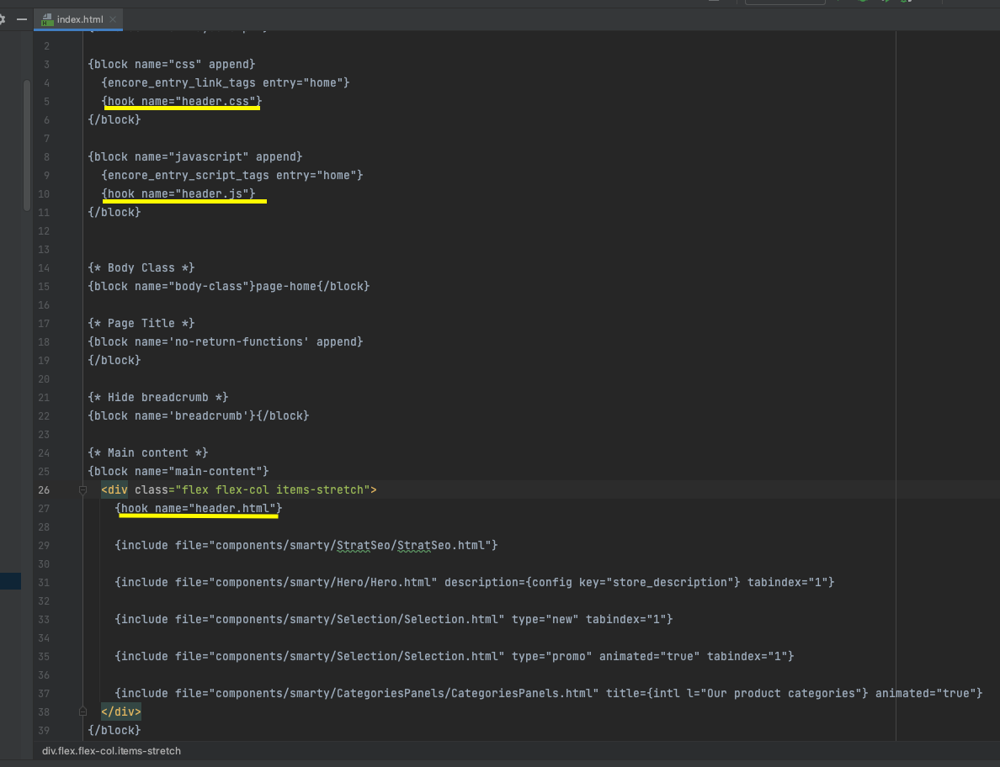

# Header Highlights

This module for Thelia add a customizable view on your home page.
You can upload you own image and overload the default template in your template for using the carousel.
This module replace thelia/Carousel

## Installation

### Manually

* Copy the module into ```<thelia_root>/local/modules/``` directory and be sure that the name of the module is HeaderHighlights.
* Activate it in your thelia administration panel

### Composer

Add it in your main thelia composer.json file

```
composer require thelia/header-highlights-module:~1.0
```

## Usage

In the configuration panel of this module, you can upload/edit the view with 3 images.

## Hook
You must define 3 hooks to render (one for html, one for css and one for js)

Here is an example : 


`{hook name="header.html"}`
`{hook name="header.css"}`
`{hook name="header.js"}`

## Loop

Customize images with the header image loop
must provide locale or lang_id parameters

[header_highlights_loop]

### Input arguments

| Argument         | Description                              |
|------------------|------------------------------------------|
| **locale**       | a string with the local ex: fr_FR        |
| **lang_id**      | an int matching with the LangId          |
| **display_type** | a string equals to "desktop" or "mobile" |

### Output arguments

| Variable             | Description                              |
|----------------------|------------------------------------------|
| $ID                  | the image ID                             |
| $TITLE               | the slide title                          |
| $CATEGORY            | category                                 |
| $CTA                 | call to action                           |
| $CATCHPHRASE         | catchphrase                              |
| $URL                 | the related URL                          |
| $IMAGE_URL           | The absolute URL to the generated image  |
| $ORIGINAL_IMAGE_URL  | The absolute URL to the original image   |
| $IMAGE_BLOCK         | position of the header image in the view |

### Exemple

```
{loop type="header_highlights_loop" name="header_highlights_loop" locale="$locale"}
    <a href="{$ORIGINAL_IMAGE_URL}" target="_blank">
        
    </a>
{/loop}
```