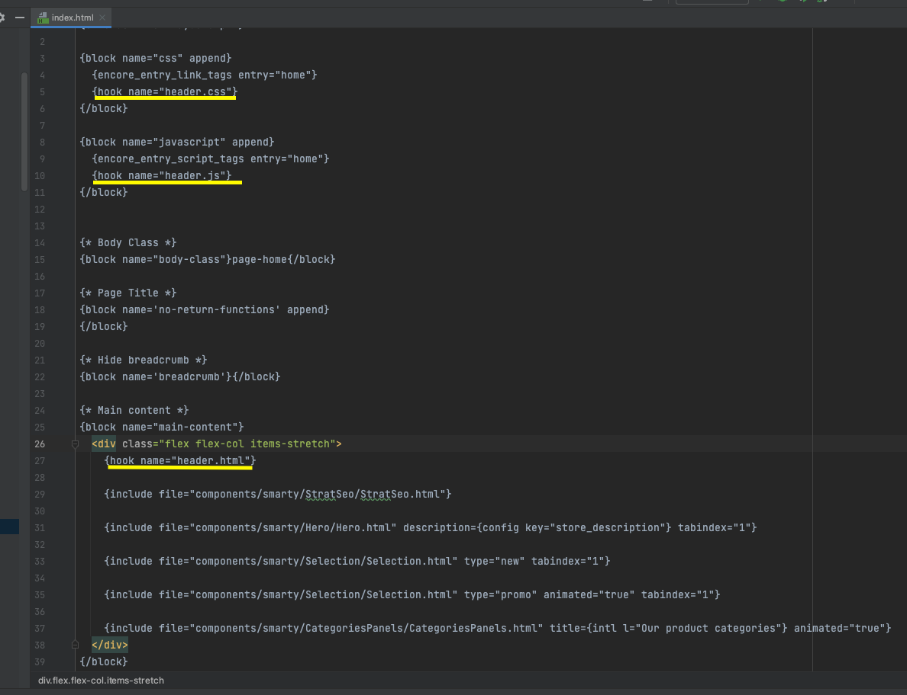

# Header Highlights

This module for Thelia add a customizable view on your home page.
You can upload you own image and overload the default template in your template for using the carousel.
This module replace thelia/Carousel

## Installation

### Manually

* Copy the module into ```<thelia_root>/local/modules/``` directory and be sure that the name of the module is HeaderHighlights.
* Activate it in your thelia administration panel

### Composer

Add it in your main thelia composer.json file

```
composer require thelia/header-highlights-module:~1.0
```

## Usage

In the configuration panel of this module, you can upload/edit the view with 3 images.

## Thelia 3 front office

The module answers the `layout.header.bottom` theme hook, which a theme usually renders on every
page, and the hook renders the `HeaderHighlights` Twig component over the `/api/header-highlights`
collection.

Blocks are keyed on the block number the configuration panel fills, 1 being the tall block of the
layout. The desktop tab and the mobile tab are filled independently, so a block configured on one
tab alone still finds its counterpart, and every block renders both wordings.

The band carries no stylesheet of its own: a theme has to style it. A Tailwind theme pins its
`@source` directories to its own template folders, so no class a module template emits is ever
scanned. The markup holds semantic classes only, and a theme that styles none of them gets an
unstyled band.

| Class | |
|---|---|
| `.Hero` | the band, a `<ul>` of one to three blocks |
| `.Hero--full` | modifier, one block configured |
| `.Hero--split` | modifier, two blocks configured |
| `.Hero-item` | one block |
| `.Hero-item--lead` | modifier, the block the panel numbers 1 |
| `.Hero-item--short` | modifier, the other blocks |
| `.Hero-image` | the `<picture>`; its `` needs a width from the theme |
| `.Hero-contain` | the wording laid over the photo |
| `.Hero-title` | |
| `.Hero-desc` | the catchphrase, rendered only where one is set |
| `.Hero-desktop` | the wording of the desktop tab. The theme hides it below its desktop breakpoint |
| `.Hero-mobile` | the wording of the mobile tab. The theme hides it from that breakpoint |

The call to action is the theme's `Molecules:Button:Base` component, `size` `large` on the lead
block and `small` on the short ones.

## Hook
You must define 3 hooks to render (one for html, one for css and one for js)

Here is an example : 


`{hook name="header.html"}`
`{hook name="header.css"}`
`{hook name="header.js"}`

## Loop

Customize images with the header image loop
must provide locale or lang_id parameters

[header_highlights_loop]

### Input arguments

| Argument               | Description                                                   |
|------------------------|---------------------------------------------------------------|
| **locale**             | a string with the local ex: fr_FR                             |
| **lang_id**            | an int matching with the LangId                               |
| **display_type**       | a string equals to "desktop" or "mobile"                      |
| **use_thelia_library** | if true, don't generate image cache and set IMAGE_URL to NULL |

### Output arguments

| Variable             | Description                              |
|----------------------|------------------------------------------|
| $ID                  | the image ID                             |
| $TITLE               | the slide title                          |
| $CATEGORY            | category                                 |
| $CTA                 | call to action                           |
| $CATCHPHRASE         | catchphrase                              |
| $URL                 | the related URL                          |
| $IMAGE_URL           | The absolute URL to the generated image  |
| $ORIGINAL_IMAGE_URL  | The absolute URL to the original image   |
| $IMAGE_BLOCK         | position of the header image in the view |

### Exemple

```
{loop type="header_highlights_loop" name="header_highlights_loop" locale="$locale"}
    <a href="{$ORIGINAL_IMAGE_URL}" target="_blank">
        
    </a>
{/loop}
```

### Exemple with TheliaLibrary

```
{loop type="header_highlights_loop" name="header_highlights_loop" locale="$locale" use_thelia_library=true}
    <a href="{$ORIGINAL_IMAGE_URL}" target="_blank">
        
    </a>
{/loop}
```
